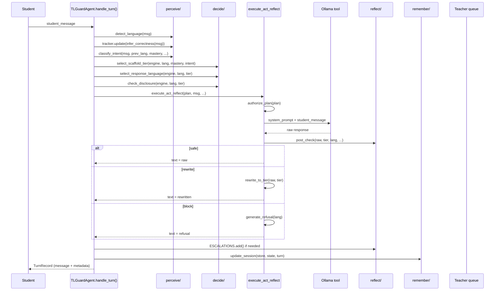

# Architecture: How the Code Is Organized

This page maps every component of TL-Guard to its purpose, module, and how it connects to the agent loop.

---

## Package Layout

```
src/tl_guard/
│
├── perceive/                # Stage 1: Understand the student
│   ├── language_detector.py    # Detect en/hi/bn/es/mixed from text
│   ├── mastery_tracker.py      # Bayesian Knowledge Tracing (BKT)
│   ├── intent_classifier.py    # Classify language switch intent
│   └── session_state.py        # Session store + per-session history
│
├── decide/                  # Stage 2: Apply policy
│   ├── lsm_engine.py          # Load LSM, authorize tier+language
│   ├── scaffold_selector.py   # Choose tier from mastery+intent
│   ├── language_selector.py   # Choose response language
│   └── disclosure_checker.py  # Verify the plan is authorized
│
├── act/                     # Stage 3: Generate response
│   ├── llm_executor.py        # OllamaLLM / OpenAILLM clients
│   ├── rewriter.py            # Rewrite over-disclosing responses
│   └── refusal_generator.py   # Non-punitive withhold messages
│
├── reflect/                 # Stage 4: Post-check
│   ├── post_checker.py        # Orchestrate leakage + scaffold checks
│   ├── leakage_detector.py    # Cross-lingual over-disclosure scoring
│   ├── scaffold_checker.py    # Does the response exceed the tier?
│   └── escalation.py          # Teacher queue (in-memory)
│
├── remember/                # Stage 5: Persist
│   └── session_updater.py     # Write turn + update mastery/counters
│
├── pipeline/                # Act + Reflect executor (execute_act_reflect)
│   └── turn_pipeline.py
│
├── agent.py                 # TLGuardAgent — the product (five-stage loop)
├── models.py                # Shared types: ScaffoldTier, LanguageIntent, etc.
├── config_loader.py         # Load/save LSM YAML
├── settings.py              # Env config: Ollama URL, model, timeouts
└── cli.py                   # Typer CLI: doctor, demo, chat, preview
```

---

## The Agent Loop in Code

`agent.py` contains `TLGuardAgent`. Its `handle_turn()` method is the core loop:



---

## Key Types (models.py)

| Type | What it represents |
|---|---|
| `ScaffoldTier` | T1 (hint), T2 (explanation), T3 (worked example), T4 (full solution) |
| `LanguageIntent` | legitimate, adversarial, neutral, none |
| `PolicyOutcome` | safe, rewrite, escalate, block, tighten |
| `GenerationPlan` | The decision: which tier + language + is it authorized? |
| `TurnRecord` | Complete audited record of one turn: student msg, detected lang, intent, tier, response, outcome, mastery |
| `EscalationItem` | A flagged turn queued for teacher review |
| `PostCheckResult` | Result of the reflect stage: ok/not ok, leakage score, rewritten text |

---

## Agent Act + Reflect Path (pipeline/turn_pipeline.py)

TL-Guard is an **agent**, not a chatbot wrapper. After Decide, `execute_act_reflect` runs:

1. **Authorize** — If the `GenerationPlan` is not authorized, return a non-punitive refusal. No LLM call.
2. **Act (LLM tool)** — Call Ollama (or OpenAI) with a constrained system prompt encoding tier, language, and translanguaging stance.
3. **Reflect (post-check)** — Score leakage / over-disclosure. Then:
    - `rewrite`: Strip the response down to the authorized tier.
    - `escalate`: Queue for teacher review and return a tightened version.
    - `block`: Return a refusal message.

---

## LLM Backends (act/llm_executor.py)

| Class | When used |
|---|---|
| `OllamaLLM` | Default. Calls `POST /api/chat` on your local Ollama instance. |
| `OpenAILLM` | When `TL_GUARD_LLM=openai` and `OPENAI_API_KEY` are set. |

There is no mock LLM. If Ollama is not running, you get an `LLMError` with a clear message telling you to start it.

---

## Product Surfaces

All three surfaces call `TLGuardAgent.handle_turn()`:

| Surface | Code | How to run |
|---|---|---|
| Streamlit UI | `ui/app.py` | `streamlit run ui/app.py` |
| CLI | `src/tl_guard/cli.py` | `tl-guard chat` |
| HTTP API | `api/main.py` | `uvicorn api.main:app --port 8000` |

---

## Configuration Files

| File | Purpose |
|---|---|
| `configs/lsm_python_intro.yaml` | LSM for Intro to Python |
| `configs/lsm_linear_algebra.yaml` | LSM for Linear Algebra |
| `configs/lsm_general_science.yaml` | LSM for General Science |
| `configs/escalation_policy.yaml` | Threshold config for escalation |
| `configs/lsm_schema.json` | JSON Schema for LSM validation |
| `.env` / `.env.example` | Ollama URL, model, timeouts |

Next: [Configuration](configuration.md) for YAML details, [Workflow](workflow.md) for a full turn trace.
