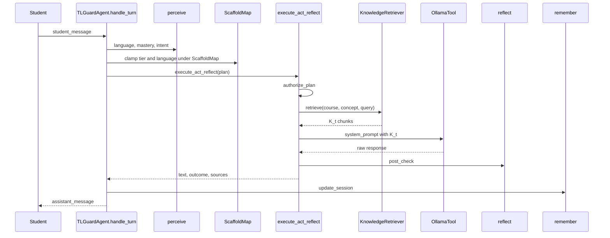

# Architecture: How the Code Is Organized

This page maps every component of TL-Guard to its purpose, module, and how it connects to the agent loop.

**Important:** TL-Guard is a **single agent** (`TLGuardAgent`), not a multi-agent swarm. Perceive / Decide / Act / Reflect / Remember are **stages of one agent**, not separate agents. The LLM (Ollama) is a **tool** used only inside Act. The product surface is a **student buddy** — there is no teacher policy console.

---

## Package Layout

```
src/tl_guard/
│
├── perceive/                # Stage 1: Understand the student
│   ├── language_detector.py
│   ├── mastery_tracker.py
│   ├── intent_classifier.py
│   └── session_state.py
│
├── decide/                  # Stage 2: Scaffold Map
│   ├── scaffold_map.py         # Frozen ScaffoldMap wrapper
│   ├── lsm_engine.py          # Authorize / clamp (matrix engine)
│   ├── scaffold_selector.py
│   ├── language_selector.py
│   └── disclosure_checker.py
│
├── act/                     # Stage 3: Context-grounded generation
│   ├── retriever.py           # Lexical KB retrieve → K_t
│   ├── llm_executor.py        # Ollama / OpenAI + system prompt
│   ├── rewriter.py
│   └── refusal_generator.py
│
├── reflect/                 # Stage 4: Post-check
│   ├── post_checker.py
│   ├── leakage_detector.py
│   ├── scaffold_checker.py
│   └── escalation.py          # Research audit log (not teacher queue)
│
├── remember/
│   └── session_updater.py
│
├── pipeline/
│   └── turn_pipeline.py       # authorize → retrieve → LLM → post-check
│
├── agent.py                 # TLGuardAgent — five-stage loop
├── models.py
├── config_loader.py         # load_scaffold_map (frozen YAML)
├── settings.py
└── cli.py
```

Curriculum snippets live under `data/kb/{course_id}/{concept}.md`. Scaffold Maps live under `configs/scaffold_map_*.yaml`.

---

## The Agent Loop in Code



---

## Key Types

| Type | Role |
|---|---|
| `ScaffoldMapConfig` | Frozen matrix $M$ + response rules $\mathcal{E}$ |
| `GenerationPlan` | Authorized tier, language, intent |
| `ContextChunk` | Retrieved KB snippet with score |
| `TurnRecord` | Full turn including `metadata.context_sources` |
| `EscalationItem` | Audit-log entry (research/debug only) |

---

## Decide: Scaffold Map

`ScaffoldMap` loads a frozen YAML matrix. Teachers do **not** edit it at runtime. Adversarial intent triggers **tighten** (or block) under fixed rules. Scaffold selection and disclosure checks reuse the matrix engine.

---

## Act: Context-Grounded LLM

After authorization:

1. `KnowledgeRetriever.retrieve(...)` scores markdown chunks by token overlap.
2. `build_system_prompt(..., context_chunks=K_t)` injects curriculum context.
3. Ollama (or OpenAI) completes under the authorized tier and language.

---

## Reflect: Self-Guardrail (No Teacher Queue)

Outcomes: SAFE / REWRITE / BLOCK. Legacy “escalate” maps to rewrite. Events may be appended to `AUDIT_LOG` for research.

---

## Surfaces

| Surface | What it does |
|---|---|
| Streamlit `ui/app.py` | Student buddy + Sources used expander |
| FastAPI `api/main.py` | Sessions/turns; `GET /scaffold-maps/{id}` read-only; `GET /audit` |
| CLI `tl-guard` | doctor, demo, chat, Scaffold Map preview |
