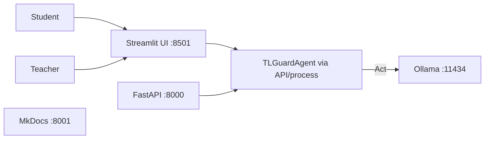

# Deployment

TL-Guard deploys as a **local multi-service agent stack**. The agent itself is `TLGuardAgent` (Perceive → Decide → Act → Reflect → Remember). Ollama is the LLM **tool** used inside Act.

## Services

| Service | Role | Port |
|---|---|---|
| Ollama (host) | Local LLM tool for Act | 11434 |
| FastAPI (`api`) | HTTP API over the agent | 8000 |
| Streamlit (`ui`) | Student Buddy + Teacher Console | 8501 |
| MkDocs (`docs`) | Documentation + paper | 8001 |



## Prerequisites

1. **Docker** and Docker Compose
2. **Ollama on the host** (recommended for research laptops — models stay outside the container)

```bash
ollama serve
ollama pull llama3
```

3. Copy env file:

```bash
cp .env.example .env
```

For containers, set Ollama to the host gateway (Compose does this by default):

```env
TL_GUARD_LLM=ollama
TL_GUARD_MODEL=llama3
TL_GUARD_OLLAMA_BASE_URL=http://host.docker.internal:11434
```

On Linux, Compose maps `host.docker.internal` via `extra_hosts: host-gateway`.

## Deploy

```bash
docker compose up --build
```

Then open:

- API health: http://127.0.0.1:8000/health
- OpenAPI: http://127.0.0.1:8000/docs
- Student / Teacher UI: http://127.0.0.1:8501
- Docs / paper: http://127.0.0.1:8001/paper/

Stop:

```bash
docker compose down
```

## Smoke checks

```bash
# From host (venv)
tl-guard doctor

curl -s http://127.0.0.1:8000/health
# {"status":"ok"}

# Create a session and turn via API
SID=$(curl -s -X POST http://127.0.0.1:8000/sessions \
  -H 'Content-Type: application/json' \
  -d '{"course_id":"python_intro","concept":"loops"}' | python3 -c "import sys,json; print(json.load(sys.stdin)['session_id'])")

curl -s -X POST "http://127.0.0.1:8000/sessions/$SID/turns" \
  -H 'Content-Type: application/json' \
  -d '{"message":"How do for loops work?"}'
```

In the UI: start a Student session, send one multilingual message, switch to Teacher → LSM Editor and confirm the matrix loads.

## Local (no Docker)

```bash
source .venv/bin/activate
pip install -e ".[dev,docs]"
cp .env.example .env
# TL_GUARD_OLLAMA_BASE_URL=http://127.0.0.1:11434

tl-guard doctor
uvicorn api.main:app --reload --port 8000 &
streamlit run ui/app.py &
mkdocs serve -a 127.0.0.1:8001
```

## Configuration volume

`./configs` is mounted into `api` and `ui` so Teacher LSM edits on disk persist across container restarts.

## Optional: OpenAI instead of Ollama

```env
TL_GUARD_LLM=openai
OPENAI_API_KEY=sk-...
TL_GUARD_MODEL=gpt-4o-mini
```

## Future work (out of scope here)

- Kubernetes / cloud multi-tenant
- AuthN/AuthZ
- Persistent session store (currently in-memory)
- Bundling Ollama inside Compose (possible, but heavy for research demos)
