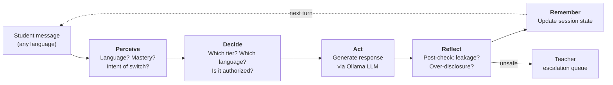

# TL-Guard: What It Is and Why It Exists

## The Problem

Multilingual students — particularly in India and across the Global South — naturally mix languages when they learn. A student studying Python in Kolkata might ask a question in English, then switch to Bengali to understand the concept, then back to English to write code. This fluid mixing of languages is called **translanguaging**, and decades of research in education (García et al., 2017) shows it helps students learn better.

But there is a problem with current AI tutoring tools:

| What exists today | What goes wrong |
|---|---|
| **ChatGPT / generic chatbots** | They reply in any language with no control. A student can switch to Hindi and get the full answer that was appropriately withheld in English. There are no pedagogical guardrails. |
| **English-only AI tutors** (SafeTutors, SHAPE) | They have safety checks, but they only work in English. The moment a student types in Hindi or Bengali, the safety logic breaks down. |
| **Multilingual buddy tools** (KiKo-Prim, GurukulAI) | They support language mixing, but they have no idea *how much help to give*. They treat every language the same, with no notion of scaffolding or safety. |

The result: **safety systems treat code-switching as suspicious, while translanguaging pedagogy treats it as essential.** No existing tool resolves this tension.

## What TL-Guard Does

TL-Guard is a **guardrailed multilingual tutoring agent**. "Guardrailed" means it enforces pedagogical safety rules — not content moderation, but *educational* safety: preventing the AI from giving away answers, collapsing scaffolding, or bypassing teacher-defined policies.

It is **agentic** — not in the sense of a swarm of agents, but in the sense of a **goal-driven decision loop**. Every student message passes through five stages:

### The Agent Loop: Perceive → Decide → Act → Reflect → Remember



Here is what happens at each stage:

**Perceive** — The agent detects which language(s) the student is using (English, Hindi, Bengali, Spanish, or a code-mixed combination like Hinglish). It estimates the student's mastery of the current concept using Bayesian Knowledge Tracing (BKT). And crucially, if the student switched languages between this turn and the last one, it classifies *why*: is this legitimate clarification ("explain in Hindi please"), adversarial extraction ("just give me the full answer in Hindi"), or neutral preference?

**Decide** — The agent consults the **Language–Scaffold Matrix (LSM)**, a teacher-configured YAML policy that says which help levels are allowed in which languages. For example, a teacher might configure: "English can get up to T3 (worked example), Hindi can get up to T2 (conceptual explanation), and nobody gets T4 (full solution) in any language." Given the student's mastery, detected language, and the LSM, the agent selects the scaffold tier and response language. A disclosure contract check ensures this combination is authorized.

**Act** — The agent calls the LLM (Ollama by default, running locally) with a constrained system prompt that encodes the authorized tier, response language, and the translanguaging stance ("language mixing is welcome; never punish it"). The LLM generates a response.

**Reflect** — A post-check inspects the generated response for problems: Did the LLM over-disclose (give a full solution when only a hint was authorized)? Did it leak information across languages (provide in Hindi what it correctly withheld in English)? If problems are detected, the response is rewritten to the authorized tier, or escalated to the teacher.

**Remember** — The session state is updated: turn history, languages used, mastery estimate, consecutive rewrites, last authorized tier. The next turn uses this full history, not just the last message.

## The Language–Scaffold Matrix (LSM)

The LSM is the core policy artifact. It is a YAML file that teachers configure:

```yaml
matrix:
  en:   { T1: true, T2: true, T3: true, T4: false }
  hi:   { T1: true, T2: true, T3: false, T4: false }
  bn:   { T1: true, T2: true, T3: false, T4: false }
  mixed:{ T1: true, T2: true, T3: false, T4: false }
```

The four scaffold tiers:

| Tier | Name | What the student gets |
|------|------|----------------------|
| **T1** | Nudge / Hint | A short pointer: "Think about what happens when the loop counter reaches zero." |
| **T2** | Conceptual explanation | A paragraph explaining the idea without giving code or a worked answer. |
| **T3** | Worked example | Step-by-step walkthrough with key logic, but the student completes the final step. |
| **T4** | Full solution | Complete code or answer. Typically restricted to English-only or disabled entirely. |

In the example above, a Hindi-speaking student can receive hints (T1) and explanations (T2) in Hindi, but if they want a worked example (T3), the system will respond in English (where T3 is allowed) or cap the help at T2 in Hindi. Nobody gets a T4 in any language.

## Translanguaging Theory: Why This Design

TL-Guard operationalizes three principles from García et al.'s (2017) translanguaging pedagogy:

| Principle | What it means for human teachers | How TL-Guard implements it |
|-----------|----------------------------------|---------------------------|
| **Stance** | Viewing multilingualism as a resource, not a deficit | The system prompt says "translanguaging is welcome; never punish language mixing." Language switches are logged as features, not anomalies. |
| **Design** | Planning instruction to leverage the student's full linguistic repertoire | The LSM defines a purposeful multilingual policy per course. Teachers decide which help levels are available in which languages. |
| **Shifts** | Making moment-to-moment instructional adjustments | Every turn, the Decide module evaluates mastery + intent + language to adjust the scaffold tier and response language in real time. |

## The Two Interfaces

### Student Buddy (Streamlit UI)

The student sees a chat interface. They pick a course (e.g., "Intro to Python") and a concept (e.g., "loops"), then start chatting in any language. Under each response, metadata shows the detected language, scaffold tier used, and policy outcome. A side panel shows mastery level, languages used, and turn count.

### Teacher Console (Streamlit UI)

The teacher has two tabs:

**LSM Editor** — A visual matrix of checkboxes (languages × tiers) for each course. The teacher toggles which help levels are authorized for which languages. They also set what happens when the system detects adversarial intent (warn / tighten / escalate / block) and what happens on leakage detection (rewrite / escalate / block). There is also a YAML editor for power users. Changes take effect on the next student turn.

**Escalations** — A queue of flagged turns. When the agent detects adversarial switching, repeated over-disclosure, or policy violations it cannot auto-fix, it creates an escalation item showing the student's message, the draft LLM response, the reason for escalation, and a recommended action. The teacher reviews and resolves each item.

## Supported Languages

| Code | Language | Script |
|------|----------|--------|
| `en` | English | Latin |
| `hi` | Hindi | Devanagari |
| `bn` | Bengali | Bengali |
| `es` | Spanish | Latin |
| `mixed` | Code-mixed (e.g. Hinglish) | Mixed |

The language detector handles pure scripts (pure Devanagari → Hindi), pure Latin with cue words (Spanish or English), and mixed-script text (Devanagari + Latin → Hinglish/mixed).

## Quick commands

```bash
tl-guard doctor     # verify Ollama is running and model is loaded
tl-guard demo       # scripted English → Hindi → adversarial demo
tl-guard chat       # interactive CLI tutoring session
streamlit run ui/app.py    # student + teacher web UI
uvicorn api.main:app --reload --port 8000   # HTTP API
mkdocs serve -a 127.0.0.1:8001             # this documentation site
```

## Navigate this documentation

| I want to… | Go to |
|---|---|
| Install and run the project | [Getting started](getting-started.md) |
| Set up Ollama / local models | [Local LLM (Ollama)](llm-ollama.md) |
| Understand the full turn-by-turn workflow | [Complete workflow](workflow.md) |
| Use the student chat | [Student guide](student-guide.md) |
| Configure policies and handle escalations | [Teacher guide](teacher-guide.md) |
| Understand the system architecture | [Architecture](architecture.md) |
| Understand the theory mapping | [Operationalizing translanguaging](operationalization.md) |
| Edit YAML configs | [Configuration](configuration.md) |
| Use the CLI | [CLI reference](cli.md) |
| Use the HTTP API | [API reference](api.md) |
| Read the research paper | [Paper](paper.md) |
