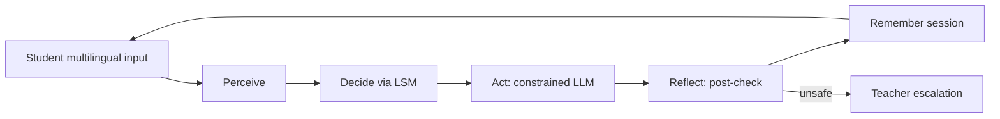

# TL-Guard Documentation

**Agentic AI as a Guardrailed Multilingual Buddy** — translanguaging support under pedagogical safety constraints.

TL-Guard is an **independent** tutoring agent (not an EduHarness fork). It runs a closed decision loop:

**Perceive → Decide → Act → Reflect → Remember**

Teachers configure a **Language–Scaffold Matrix (LSM)** so students can mix languages safely without unrestricted answer leakage.

## What you can do here

| Goal | Start here |
|------|------------|
| Install and run locally | [Getting started](getting-started.md) |
| Connect Ollama / local models | [Local LLM (Ollama)](llm-ollama.md) |
| Understand the full product flow | [Complete workflow](workflow.md) |
| Use the student chat | [Student guide](student-guide.md) |
| Configure policies & escalations | [Teacher guide](teacher-guide.md) |
| Call the HTTP API | [API reference](api.md) |

## Quick commands

```bash
# health-check local model
tl-guard doctor

# scripted multilingual demo
tl-guard demo

# student + teacher UI
streamlit run ui/app.py

# API
uvicorn api.main:app --reload --port 8000

# this documentation site
mkdocs serve -a 127.0.0.1:8001
```

!!! tip "Default LLM"
    TL-Guard uses **Ollama** by default (`llama3` on `http://127.0.0.1:11434`). There is **no mock LLM** in production. See [Local LLM (Ollama)](llm-ollama.md).

## Core idea



Safety systems often treat code-switching as suspicious. Translanguaging pedagogy treats it as essential. TL-Guard is **language-tolerant but pedagogically strict**.
