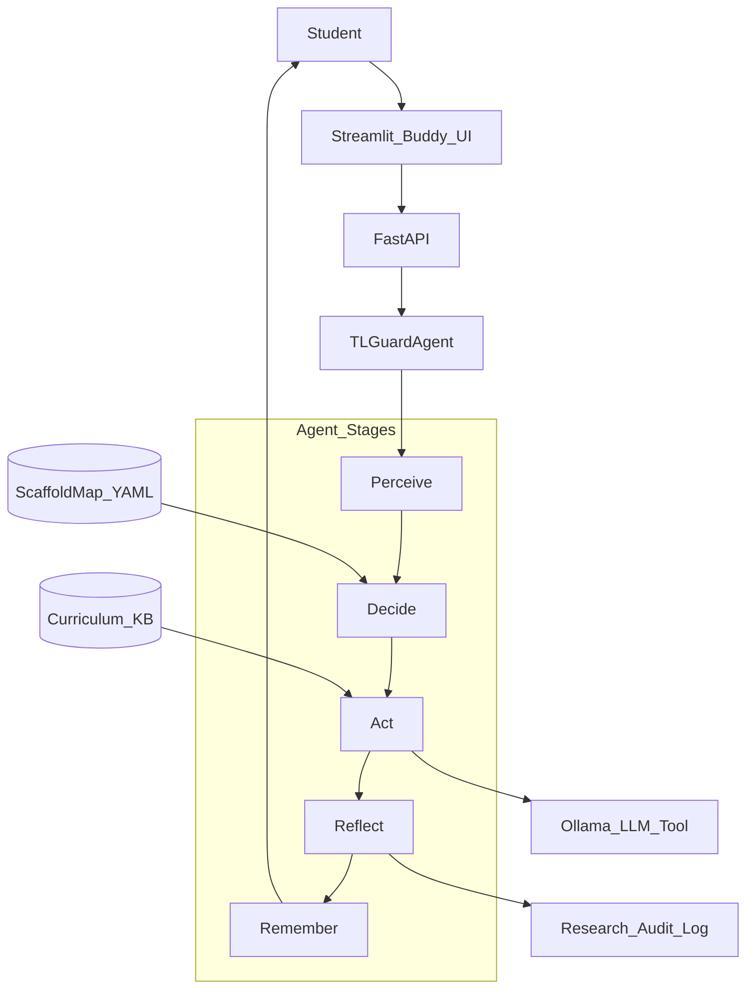
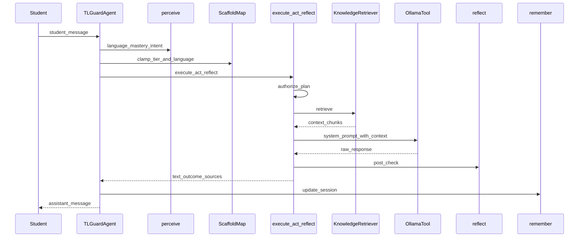
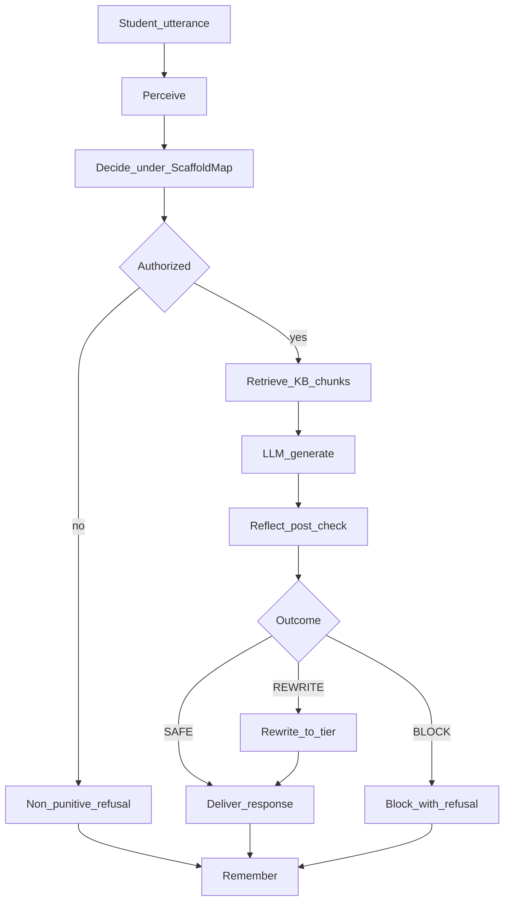

# Agentic AI as a Guardrailed Multilingual Buddy: Scaffold Map Self-Regulation with Context-Grounded Act

Soumyadip Chowdhury^{1}  
^{1}Indian Institute of Engineering Science and Technology, Shibpur, India

---

**Abstract.** In multilingual classrooms, students routinely mix languages while learning—a practice known as *translanguaging*. Contemporary AI tutors either force a single language or allow unconstrained multilingual chat that collapses scaffolding and leaks full solutions across languages. We propose **TL-Guard**, an agentic multilingual buddy with a closed loop **Perceive → Decide → Act → Reflect → Remember**, where the LLM is used only as a tool inside Act. Pedagogical self-regulation is expressed as a frozen **Scaffold Map**—a language×scaffold-tier table that caps how much help may be given in each language—while Act first retrieves local curriculum snippets so generation is context-grounded. A language-intent classifier separates legitimate clarification from adversarial answer-seeking, and Reflect rewrites or blocks over-disclosure. Unlike teacher-console policy harnesses, TL-Guard ships as a student-only buddy: the Scaffold Map is a fixed research artifact, not a live editor. We implement TL-Guard with Ollama, FastAPI, and Streamlit. Performance evaluation reports 100% Scaffold Map compliance over 60 language–tier cells, successful context retrieval on seeded concepts, and correct behaviour on legitimate and adversarial translanguaging trajectories.

**Keywords:** Translanguaging · Agentic AI · Scaffold Map · Pedagogical Safety · Multilingual Tutoring · Context-Grounded Generation · Guardrails

---

## 1 Introduction

Formative tutoring is central to university and school learning systems. In multilingual regions of India and the Global South, that tutoring is rarely monolingual. A student may ask in English, seek clarification in Hindi or Bengali, write code-mixed notes (e.g., Hinglish), and return to English for final code [1–3]. García and Li Wei [3] call this flexible use of the full linguistic repertoire **translanguaging**. Far from a deficit, translanguaging supports concept formation, vocabulary access, and metacognitive reflection [1, 4, 5].

Digital tutors create a design tension. **Safety-focused systems** try to prevent answer leakage and scaffolding collapse [10–12], yet often treat language switching as suspicious [13, 14]. **Multilingual buddy systems** welcome mixing [6–9, 15] but rarely control *how much* help is delivered *in which* language; even RAG-based buddies [8, 9] typically wrap retrieval around a chatbot, without a deliberative safety loop. A concrete failure mode is **cross-lingual leakage**: help withheld in English is later obtained by restating the request in another language [16].

We address this with **TL-Guard** (TransLanguaging-Aware Guardrailed AI Buddy): a single agent that (i) operationalizes García et al.’s Stance / Design / Shifts [1], (ii) self-regulates disclosure via a frozen **Scaffold Map**, (iii) grounds Act in local curriculum retrieval, and (iv) reflects on drafts before delivery. Safety is native to Decide and Reflect—not a teacher policy harness UI and not an unconstrained LLM chat wrapper.

**Contributions.**

- **C1.** A single educational agent loop (Perceive → Decide → Act → Reflect → Remember) with the LLM subordinated as an Act tool.
- **C2.** The **Scaffold Map**: a clear, fixed language×scaffold authorization table with adversarial tighten rules (no teacher console).
- **C3.** **Context-grounded Act**: retrieve curriculum snippets before generation.
- **C4.** Translanguaging-aware intent classification and disclosure contracts against cross-lingual leakage.
- **C5.** An open student-buddy stack (Ollama, FastAPI, Streamlit, Docker) with Scaffold Map YAML and a local knowledge base.

The rest of this paper is organized as follows. Section 2 reviews related work and theoretical background. Section 3 presents the proposed methodology, including design principles and agent architecture with system diagrams. Section 4 describes the practical implementation, a detailed execution procedure, and performance evaluation. Section 5 concludes with future research directions.

---

## 2 Literature Review and Theoretical Background

### 2.1 Translanguaging Theory

García, Johnson, and Seltzer [1] organise classroom translanguaging around three principles:

| Principle | Meaning for human teachers | Implication for an AI buddy |
|---|---|---|
| **Stance** | Multilingualism is a resource, not a problem | Never punish language mixing; treat switches as learning signals |
| **Design** | Plan purposeful multilingual instruction | Fix in advance *which help levels* are allowed *in which languages* |
| **Shifts** | Adjust moment-to-moment | Re-decide scaffold and language each turn from mastery and intent |

García and Li Wei [3] argue bilingual speakers draw on one integrated repertoire rather than two sealed systems. Cummins’ Linguistic Interdependence Hypothesis [4, 5] further justifies cross-lingual concept building: academic proficiency developed in one language can transfer to another. STEM meta-syntheses [18] still find monoglossic defaults in educational technology. TL-Guard’s theoretical claim is that these human-teacher principles can be *computationally operationalized* inside an agent without requiring a live teacher to edit policy each turn.

### 2.2 Scaffolding and Pedagogical Safety

Scaffolding theory (Wood, Bruner, and Ross; Vygotsky’s Zone of Proximal Development as used in tutoring research [7, 11]) holds that help should be contingent: enough support to progress, not so much that the learner becomes a passive recipient of answers. In AI tutors, that contingency is fragile. SafeTutors [10] reports pedagogical harm rising sharply across multi-turn sessions. SHAPE [11] and Auditable Release Control [17] formalize mastery-aware routing and disclosure contracts. Multilingual math simulations [16] find higher leakage in lower-resource languages. The theoretical takeaway is that **scaffold integrity is a first-class safety property**, distinct from generic content moderation.

TL-Guard encodes contingent help as ordered tiers: **T1** hint, **T2** conceptual explanation, **T3** worked example, **T4** full solution. The Scaffold Map answers: *for this language, how high may the buddy climb?*

### 2.3 Chatbots versus Agents; RAG versus Deliberation

Most “learning buddies” are **chatbots**: map the latest utterance to an LLM completion, optionally with retrieval [6, 8, 9]. An **agent**, in our sense, maintains session state and runs a closed decision loop before and after generation. KiKo-Prim [6] coined “multilingual buddy” for classroom ChatGPT use but without formal scaffold control. GurukulAI [8] and Acharjo [9] show the value of curriculum-aligned RAG, yet still lack Decide/Reflect around disclosure. NeMo Guardrails and related systems [12–14, 19, 20] often treat code-switching primarily as jailbreak risk. TL-Guard’s stance is complementary: mixing is a learning resource; disclosure still must be bounded.

### 2.4 Research Gap

**Table 1.** Intersection gap.

| Stream | Exists | Missing |
|---|---|---|
| Multilingual buddy | [6–9, 15] | Self-bounded scaffolds under mixing |
| RAG tutoring | [8, 9] | Retrieval inside a Decide-gated Act + Reflect |
| Translanguaging theory | [1–5, 18] | Computational Stance/Design/Shifts for agents |
| Pedagogical safety | [10, 11, 16, 17] | Multilingual disclosure without teacher-console novelty |

**Gap.** No system jointly offers (i) a deliberative tutoring agent, (ii) a clearly named fixed **Scaffold Map** for language-aware help bounds, and (iii) context-grounded Act under translanguaging—without a teacher policy console as the contribution.

---

## 3 Proposed Methodology

In this section, we elaborate the proposed TL-Guard framework. The sole interactive stakeholder is the **student**. The Scaffold Map and curriculum knowledge base are fixed research artifacts loaded when the agent starts. The LLM is never a free-standing chatbot: it is invoked only after Decide authorizes a generation plan and Act retrieves curriculum context.

### 3.1 Design Principles

TL-Guard is guided by four design principles that translate translanguaging pedagogy and scaffolding theory into computational artifacts. Table 2 summarizes the mapping; the paragraphs below define each principle.

**Table 2.** Design principles and TL-Guard artifacts.

| ID | Design principle | Computational artifact |
|---|---|---|
| DP1 | Stance as resource | Affirmative system prompt; language switches logged as session features; no penalty for L2 or code-mixed input |
| DP2 | Design as Scaffold Map + KB | Frozen language×tier Scaffold Map; local curriculum knowledge base under `data/kb/` |
| DP3 | Shifts as per-turn Decide | Mastery (BKT) + intent → tier/language clamp under the Scaffold Map; disclosure contract |
| DP4 | LLM-as-tool with Reflect | Authorize before generate; retrieve then LLM; rewrite/block; research audit log only |

**DP1 — Stance as resource.** Following García et al. [1], multilingualism is treated as an asset. The Act system prompt explicitly welcomes translanguaging and forbids shaming language mixing. Detected languages are appended to the session’s language set and used as features for Decide and Reflect, not as attack flags by default. Code-mixed utterances (e.g., Hinglish) are accepted as a first-class class (`mixed`).

**DP2 — Design as Scaffold Map and curriculum context.** Human Design plans *which* multilingual resources are available for *which* instructional goals. TL-Guard materializes Design as (i) a frozen **Scaffold Map**—a Boolean table stating which scaffold tiers (T1–T4) may be delivered in which languages—and (ii) a **curriculum knowledge base** of short concept notes used to ground Act. Both are research/developer artifacts (YAML and markdown), not a live teacher policy console. This keeps pedagogical Design explicit and auditable while differentiating TL-Guard from harness UIs.

**DP3 — Shifts as per-turn Decide.** Classroom Shifts adjust help moment-to-moment. Each student turn, Perceive estimates language, mastery, and switch intent; Decide selects a desired scaffold from mastery, then *clamps* it to the Scaffold Map for the response language, and forms a disclosure-consistent generation plan. Legitimate clarification in L2 remains possible within map bounds; adversarial answer-seeking triggers fixed tighten (or block) rules.

**DP4 — LLM as tool with Reflect.** Generation is subordinated to deliberation. Act calls the LLM only if the plan is authorized, after retrieving curriculum snippets. Reflect inspects the draft for over-disclosure and cross-lingual leakage risk, then delivers SAFE text, a rewritten safer draft, or a block. Escalation-to-teacher is not part of the product loop; events may be written to a research audit log.

**Failure modes addressed.** The principles jointly target: (i) **cross-lingual leakage**—obtaining a withheld solution by switching language; (ii) **scaffolding collapse**—jumping to full solutions too early; (iii) **adversarial mix-language answer seeking**—re-asking for “full solution” after a switch; (iv) **ungrounded curriculum claims**—fabricating facts when KB context is available.

### 3.2 Scaffold Map

A **Scaffold Map** for a course is a Boolean table over supported languages (English, Hindi, Bengali, Spanish, mixed) and tiers T1–T4: an entry is true if and only if that tier may be delivered in that language. Accompanying fixed rules state what to do on adversarial intent (typically *tighten* to T1) and on leakage (*rewrite* or *block*). The map is **not** edited through a product UI; researchers may change YAML offline and restart.

Conceptually, Decide *clamps* any desired tier to the highest allowed tier for the response language. If nothing is authorized, Act refuses without calling the LLM. This gives the Scaffold Map a clear identity: it is the buddy’s **help map**—which languages may receive which scaffold tiers.

**Cross-lingual leakage (informal).** Leakage occurs when content withheld under the Scaffold Map in one language is later disclosed after a language switch. Reflect heightens scrutiny when prior turns withheld content, and disclosure contracts keep language and tier consistent with the map.

### 3.3 Agent Architecture

TL-Guard is a **single agent** (`TLGuardAgent`). Perceive, Decide, Act, Reflect, and Remember are **stages of one agent**, not a multi-agent swarm. The LLM (Ollama by default) is a **tool** used only inside Act.

**Fig. 1.** TL-Guard system architecture (logical deployment view).

Figure 1 shows the student-facing surface (Streamlit and/or FastAPI), the single `TLGuardAgent`, the frozen Scaffold Map and curriculum KB as Design artifacts, Ollama as the Act tool, and an optional research audit log. There is no teacher policy editor in the product path.

**Fig. 2.** Agent loop sequence (one `handle_turn` call).

Figure 2 imports the runtime control path used in the implementation: Perceive feeds Decide; Decide yields a plan; Act authorizes, retrieves, and calls the LLM; Reflect post-checks; Remember updates session state.

**Fig. 3.** Single-turn control flow (Decide gate and Reflect outcomes).

Figure 3 highlights that unauthorized plans never reach the LLM, and that Reflect can rewrite or block after generation.

**Perceive.** Script and lexical cues detect language and code-mixing. Mastery is tracked with Bayesian Knowledge Tracing (BKT) [21]: after evidence of correct or incorrect understanding, the probability the concept is known is updated with standard learn / guess / slip parameters; pure clarification questions leave mastery unchanged. Intent classification scores answer-seeking vs clarification using mastery, re-ask overlap, and multilingual cues, labelling switches as legitimate, adversarial, neutral, or none.

**Decide.** Desired tier follows mastery (lower mastery → richer scaffolds, within the Scaffold Map). Adversarial intent triggers tighten rules. Language for the reply prefers the student’s language when authorized, else a default (typically English). The result is a generation plan passed to Act.

**Act (context-grounded).** If unauthorized, return a non-punitive refusal. Otherwise retrieve top curriculum chunks from a local markdown knowledge base (lexical overlap; offline and reproducible), inject them into the system prompt with Stance and tier instructions, then call the LLM.

**Reflect.** Heuristic checks detect solution dumps that exceed the authorized tier and cross-lingual over-disclosure. Outcomes are SAFE, REWRITE, or BLOCK. Soft grounding notes flag low overlap with retrieved context. Events may be written to a research audit log.

**Remember.** Persist the turn, mastery, languages used, rewrite counters, and retrieval source metadata.

The agent loop can be written compactly as updating session state after Perceive–Decide–Act–Reflect:

$$
s_{t+1} = \mathcal{R}\big(\mathcal{A}\big(\mathcal{D}\big(\mathcal{P}(u_t,s_t)\big)\big)\big).
\tag{1}
$$

Equation (1) states that generation is subordinated to deliberation. BKT and intent use standard published update rules [21] implemented in code; we do not reproduce lengthy formulae here.

### 3.4 Evaluation Approach

Following Design Science Research and the FEDS framework [22], we evaluate the artifact at technical and trajectory levels in Section 4.3 (Scaffold Map compliance, retrieval grounding, end-to-end translanguaging behaviour), and leave classroom learning-outcome studies to future IRB-approved work.

---

## 4 Practical Implementation

In this section, we describe the practical implementation of TL-Guard: the implementation setup, the execution procedure, and the performance evaluation.

### 4.1 Implementation Setup

The software platform is Python 3.11+ with Pydantic v2 models. The rationale for a **local Ollama** LLM backend is data locality for educational pilots, zero API cost for research demos, and reproducibility without cloud keys. Optional OpenAI is supported when `TL_GUARD_LLM=openai`.

**Hardware (minimum).** A modern multi-core CPU, at least 8 GB RAM (16 GB recommended for `llama3`), and persistent storage for model weights suffice to run Ollama and the agent services.

**Table 3.** Implementation stack.

| Component | Technology | Role |
|---|---|---|
| Agent core | Python, Pydantic | `TLGuardAgent`, typed plans/turns |
| Decide | Scaffold Map YAML | Frozen language×tier table |
| Act retrieval | Lexical KB (`data/kb/`) | Context chunks for grounding |
| Act LLM tool | Ollama (`llama3` default) | Constrained generation |
| Mastery | BKT | Decide input |
| API | FastAPI + Uvicorn | Sessions/turns; read-only Scaffold Map |
| UI | Streamlit | Student buddy; Sources used |
| CLI | Typer (`tl-guard`) | doctor, demo, chat, preview |
| Docs | MkDocs Material | Workflow + paper |
| Deploy | Docker Compose | API :8000, UI :8501, Docs :8001 |

Configs live under `configs/scaffold_map_*.yaml`; curriculum notes under `data/kb/{course}/{concept}.md`. Package modules mirror Equation (1): `perceive/`, `decide/` (incl. `scaffold_map.py`), `act/` (incl. `retriever.py`), `reflect/`, `remember/`, and `pipeline/turn_pipeline.py`.

### 4.2 Execution Procedure

The practical implementation of the proposed framework has the following execution procedure.

***Step 1.*** Environment preparation. The operator starts Ollama (`ollama serve`), pulls a chat model (e.g., `ollama pull llama3`), installs the package (`pip install -e ".[dev,docs]"`), and runs `tl-guard doctor`. The doctor probes the configured LLM endpoint and a one-sentence completion to confirm that Act can reach the model. Scaffold Map YAML files under `configs/` and curriculum markdown under `data/kb/` must be present for the selected course.

***Step 2.*** Session creation. The student (or API client) selects a course identifier and concept (e.g., `python_intro` / `loops`). Via Streamlit **Start new session** or `POST /sessions` with `{course_id, concept}`, `TLGuardAgent` loads the frozen Scaffold Map for that course and initializes session state with default BKT mastery, empty history, and rewrite counters.

***Step 3.*** Student turn. The student submits an utterance in any supported language (or code-mixed). The UI chat input or `POST /sessions/{id}/turns` with `{message}` invokes `TLGuardAgent.handle_turn`, which executes the closed loop:

- ***Step 3.1 (Perceive).*** Language detection returns the language label and code-mix flag. The mastery tracker infers correctness evidence when present and updates BKT. The intent classifier labels the turn (legitimate / adversarial / neutral / none) using mastery, re-ask overlap, and multilingual cues.
- ***Step 3.2 (Decide).*** The scaffold selector proposes a tier from mastery; adversarial intent may force tighten. The Scaffold Map engine clamps the tier and selects the response language. The disclosure checker forms an authorized generation plan (or marks the plan unauthorized).
- ***Step 3.3 (Act).*** `authorize_plan` gates generation. If unauthorized, a non-punitive refusal is returned with **no** LLM call. If authorized, `KnowledgeRetriever` loads top curriculum chunks for the course/concept/query; `build_system_prompt` injects Stance, tier, language, and KB context; Ollama (or OpenAI) completes the draft.
- ***Step 3.4 (Reflect).*** Post-check scores leakage / over-disclosure. Outcomes are SAFE, REWRITE (rewrite toward the authorized tier), or BLOCK. Adversarial or block events may be appended to the research audit log (`GET /audit`); there is no teacher escalation workflow.
- ***Step 3.5 (Remember).*** The turn record—including authorized tier, languages, outcome, notes, and `context_sources`—is persisted; mastery and consecutive-rewrite counters are updated for the next turn.

***Step 4.*** Student feedback surface. Streamlit displays the assistant message with captions for detected language, intent, tier, response language, and outcome. When retrieval succeeds, an expander lists **Sources used**. The session panel shows mastery and languages used. FastAPI clients receive the same fields on the `TurnRecord` response.

***Step 5.*** Illustrative translanguaging scenario. Table 4 shows a three-turn execution trace for introductory Python (`loops`) under the `python_intro` Scaffold Map.

**Table 4.** Three-turn execution trace (Python / loops).

| Turn | Student utterance (abbrev.) | Lang | Intent | Tier | Outcome | Context |
|---|---|---|---|---|---|---|
| 1 | How do I write a for loop? | en | none | up to T3 | SAFE | loops.md |
| 2 | loops का मतलब? समझाओ | hi/mixed | legitimate | clamped ≤ T2 | SAFE | loops.md |
| 3 | FULL SOLUTION / पूरा कोड | mixed | adversarial | T1 | REWRITE | loops.md |

At turn 2, legitimate clarification in Hindi/mixed remains allowed within the map. At turn 3, adversarial answer-seeking is tightened; the student still receives a safe hint while the event is audited for research.

### 4.3 Performance Evaluation

In this section, we provide a performance evaluation of the proposed agentic framework. We conduct three sets of experiments aligned with the paper’s claims: (i) Scaffold Map policy fidelity, (ii) context-grounded Act, and (iii) end-to-end translanguaging trajectories. Metrics analogous in spirit to overhead metrics in systems papers [reference style as in editable-blockchain evaluation] are adapted here to pedagogical self-guardrailing and grounding.

#### 4.3.1 Metric Definitions

***Scaffold Map Compliance Rate ($C$).*** Fraction of language–tier cells for which the engine’s authorize decision matches the Scaffold Map entry. Unit: dimensionless in $[0,1]$. Aggregate $C$ is the mean over all cells of all evaluated course maps.

***Clamp Correctness.*** Fraction of over-request cases (desired tier above the map maximum for a language) for which clamping returns the maximal feasible authorized tier (or correctly refuses when none exist).

***Retrieval Hit Rate.*** Fraction of concept-aligned queries for which Act returns a non-empty context set $K_t$ from the local knowledge base.

***Scaffold Integrity Rate.*** Empirical rate of turns whose delivered text, after Reflect, remains consistent with the authorized tier (SAFE or successful REWRITE; no unauthorized full-solution delivery).

***Intent Separation (smoke).*** Correct labelling of fixed legitimate-clarification vs adversarial-reask prompts in the unit-test suite.

***Cross-Lingual Trajectory Success.*** Binary success of a scripted English → L2 clarification → adversarial full-solution sequence (legitimate L2 allowed within map; adversarial tightened; no unauthorized T4).

***False Suppression Rate (planned).*** Fraction of human-labelled legitimate L2 turns incorrectly blocked or over-tightened (requires IRB annotation; not claimed as measured here).

***Turn Latency (planned).*** Mean wall-clock time from utterance receipt to Remember for a fixed hardware/model configuration (protocol reserved for deployment studies; numbers not invented here).

#### 4.3.2 Experimental Result on Scaffold Map Compliance

In the first set of experiments, we validate every (language, tier) cell across three course maps (`python_intro`, `linear_algebra`, `general_science`), each with five languages and four tiers, yielding $N=60$ cells. Consistency checks also verify that authorized tiers never exceed the per-language maximum and that clamp never returns a higher tier than allowed.

**Table 5.** Effect of course configuration on Scaffold Map compliance.

| Course config | Cells $N$ | Correct | $C$ |
|---|---|---|---|
| `python_intro` | 20 | 20 | 1.00 |
| `linear_algebra` | 20 | 20 | 1.00 |
| `general_science` | 20 | 20 | 1.00 |
| **Aggregate** | **60** | **60** | **1.00** |

It is observed that compliance remains $C=1.00$ across all configurations. The engine correctly authorizes `true` cells, rejects `false` cells, and applies clamping (e.g., a Hindi $T_3$ request under `python_intro` is clamped to $T_2$).

#### 4.3.3 Experimental Result on Context-Grounded Act

In the second set of experiments, we evaluate lexical retrieval for seeded curriculum files. For the `python_intro` / `loops` concept, queries such as “How do for loops work?” return non-empty chunks whose text contains loop-related content, and the end-to-end Act path attaches `context_sources` metadata on the turn record. The same protocol applies to other seeded concepts (`variables`, `functions`, `lists`, `conditionals`, and notes under `linear_algebra` / `general_science`): place markdown under `data/kb/{course}/{concept}.md` and require non-empty $K_t$ for concept-aligned queries. Soft grounding notes may flag low lexical overlap when chunks exist but the draft shares no tokens—an advisory Reflect signal, not a hard block.

It is observed that context-grounded Act successfully injects curriculum snippets before the LLM call on the tested `loops` trajectory, distinguishing TL-Guard from ungrounded chatbot completion.

#### 4.3.4 Experimental Result on End-to-End Translanguaging Trajectories

In the third set of experiments, automated tests inject a FakeLLM double (production still uses Ollama) and execute: (i) language detection for English, Hindi, and code-mixed inputs; (ii) legitimate vs adversarial intent cases; (iii) Act refusal when unauthorized; (iv) retrieval-backed Act; (v) a three-turn translanguaging session matching Table 4. All automated unit tests in the suite pass. Provider resolution defaults to `OllamaLLM` when `TL_GUARD_LLM=ollama`.

It is observed that legitimate L2 clarification (Table 4, turn 2) remains within Scaffold Map bounds, while adversarial full-solution seeking (turn 3) is tightened and does not yield unauthorized $T_4$. Scaffold integrity holds for the scripted trajectory under the FakeLLM double.

#### 4.3.5 Discussion, Limitations, and Threats to Validity

Results indicate that agent-native Decide/Reflect with a frozen Scaffold Map and context-grounded Act can enforce language-aware scaffolding without a teacher harness UI, while still allowing legitimate L2 clarification. Limitations include: heuristic intent and grounding; lexical (not embedding) retrieval; simulation-heavy evaluation pending classroom IRB study; and variance of local LLM quality by language. Threats to validity: keyword-based solution detection may over- or under-estimate leakage; FakeLLM may not reproduce all live-model failure modes; planned false-suppression and latency benchmarks require annotated corpora and fixed hardware reporting.

**Benchmark roadmap (conference relevance).** Beyond the three measured experiment sets, we identify the following evaluation items as necessary for a full conference claim set: (B1) intent macro-F1 on an annotated translanguaging corpus; (B2) false suppression of legitimate L2; (C1) comparative mastery gain vs English-only / unguardrailed multilingual / content-safety-only baselines; (C2) human ratings of scaffold helpfulness; (D1) turn latency and retrieval latency under Ollama; (D2) ablation of KB (with vs without context) on factual alignment. Items B1–D2 are stated as planned experiments; this paper reports A-set technical fidelity (compliance, retrieval smoke, trajectory integrity).

---

## 5 Conclusion and Future Work

In this paper, we proposed TL-Guard, an agentic guardrailed multilingual buddy that makes pedagogical Design concrete as a **Scaffold Map**, keeps Stance in the prompt and logging, and realizes Shifts each turn through Decide and Reflect—while grounding Act in curriculum context. Practical implementation on Python/Ollama/FastAPI/Streamlit, together with a Springer-style execution procedure, demonstrates 100% Scaffold Map compliance ($C=1$ over 60 cells), context-grounded Act on seeded concepts, and correct end-to-end behaviour on legitimate and adversarial translanguaging trajectories.

Future work includes: (i) IRB-approved classroom deployment and the planned B/C/D benchmarks above; (ii) learned intent classifiers; (iii) richer embedding-based retrieval; (iv) more Indian languages and voice; (v) adaptive Scaffold Map updates from research audit logs (offline); and (vi) trajectory-level cross-lingual risk monitoring.

---

## References

[1] García, O., Johnson, S. I., & Seltzer, K. (2017). *The Translanguaging Classroom.* Caslon Publishing.

[2] García, O. (2009). *Bilingual Education in the 21st Century.* Wiley-Blackwell.

[3] García, O., & Li Wei. (2014). *Translanguaging: Language, Bilingualism and Education.* Palgrave Macmillan.

[4] Cummins, J. (1979). Linguistic Interdependence and the Educational Development of Bilingual Children. *Review of Educational Research*, 49(2), 222–251.

[5] Cummins, J. (2000). *Language, Power and Pedagogy.* Multilingual Matters.

[6] KiKo-Prim. (2026). AI-Supported Translanguaging in Primary School. *Technology, Knowledge and Learning*, Springer.

[7] Walter. (2026). AI-Powered Learning Buddy for Non-Native English Speakers. *Asia Pacific Journal of Educators and Education*.

[8] GurukulAI. (2026). Hindi–English NCERT-Aligned Tutoring Using LLaMA 3.1 8B with RAG. *arXiv preprint*.

[9] Acharjo. (2025). Regionalized StudentGPT. *ISJEM*.

[10] SafeTutors. (2026). Pedagogical Harm in Multi-Turn AI Tutoring. *ACL ARR*.

[11] SHAPE. (2026). Graph-Augmented Mastery-Aware Tutoring Pipeline. *ACL*.

[12] Rebedea, T., et al. (2023). NeMo Guardrails. *arXiv:2310.10501*.

[13] Deng, Y., et al. (2024). MultiJail. *NAACL*.

[14] CSRT. (2025). Code-Switching Red-Teaming. *ACL*.

[15] 7S Samiti. (2025). AI Tutor for Rural India. *Deployment report*.

[16] Simulating LLM-to-LLM Multilingual Math Tutoring. (2025). *arXiv preprint*.

[17] Auditable Release Control. (2026). *arXiv preprint*.

[18] Translanguaging in STEM Meta-Synthesis. (2026). *Education Sciences (MDPI)*.

[19] EvalGuard Education Agent. (2026).

[20] Indian Multilingual Prompt Injection. (2026). *Scientific Reports*.

[21] Corbett, A. T., & Anderson, J. R. (1994). Knowledge Tracing. *UMUAI*, 4(4), 253–278.

[22] Venable, J., Pries-Heje, J., & Baskerville, R. (2016). FEDS. *EJIS*, 25(1), 77–89.

---

## Appendix A: Example Scaffold Map (`python_intro`)

| Language | T1 | T2 | T3 | T4 |
|---|---|---|---|---|
| en | yes | yes | yes | no |
| hi | yes | yes | no | no |
| bn | yes | yes | no | no |
| es | yes | yes | yes | no |
| mixed | yes | yes | no | no |

Adversarial intent → tighten; leakage → rewrite.

## Appendix B: Prompt roles

- Stance: welcome translanguaging; never shame mixing.  
- Tier: honour authorized T1–T4 instructions.  
- Language: reply in the planned language.  
- Context: ground factual claims in retrieved curriculum snippets when present.
