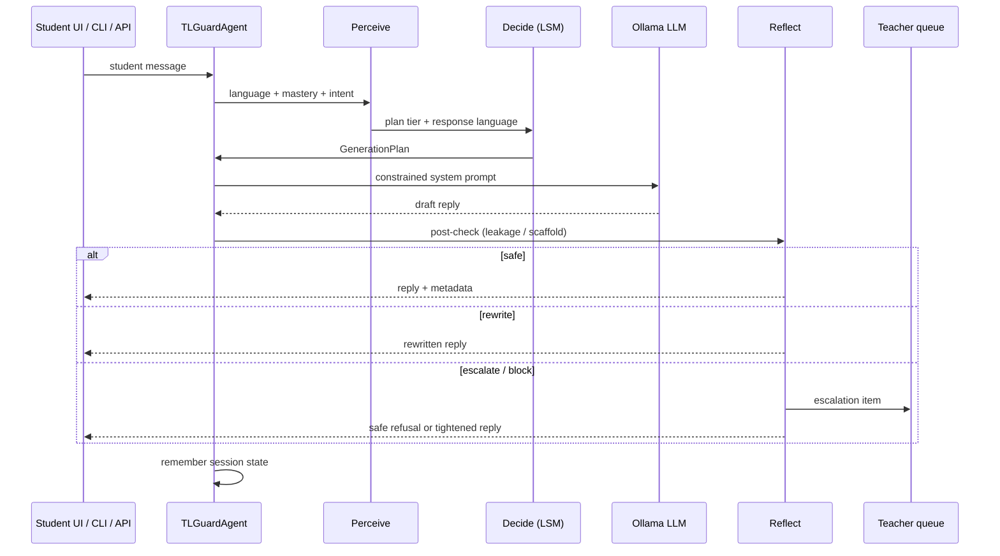

# Complete workflow

End-to-end path from student message to guarded reply (and optional teacher escalation).

## High-level loop

## Step by step

### 1. Session start

- Choose a **course** (`python_intro`, `linear_algebra`, `general_science`).
- Choose a **concept** (e.g. `loops`).
- Agent loads the course **LSM** YAML from `configs/`.

### 2. Perceive

| Signal | Module | Output |
|--------|--------|--------|
| Language / code-mix | `perceive/language_detector.py` | `en`, `hi`, `bn`, `es`, `mixed` |
| Mastery | `perceive/mastery_tracker.py` (BKT) | float in (0,1) |
| Switch intent | `perceive/intent_classifier.py` | legitimate / adversarial / neutral / none |
| History | `perceive/session_state.py` | prior turns, languages, last tier |

### 3. Decide

1. **Scaffold selector** — mastery + intent → desired tier T1–T4  
2. **LSM engine** — clamp to what the language allows  
3. **Language selector** — prefer student language if authorized  
4. **Disclosure checker** — confirm `(language, tier)` contract  

Result: `GenerationPlan`.

### 4. Act (pipeline)

`pipeline/turn_pipeline.py`:

1. **verify** — reject unauthorized plans → non-punitive refusal  
2. **LLM** — Ollama (or OpenAI) with tier + language constraints in the system prompt  
3. **post-check** — leakage / over-disclosure heuristics  
4. **output** — safe text, rewrite, escalate, or block  

### 5. Reflect & escalate

If adversarial intent or repeated rewrites:

- Item added to `reflect/escalation.py` queue  
- Teacher UI shows reason, student text, draft, recommended action  

### 6. Remember

Session store updates:

- turns, languages used, mastery, consecutive rewrites, last authorized tier  

Next turn uses this memory (not last message alone).

## Typical student journey

1. Ask in English → mid/high scaffold (e.g. T2/T3 if LSM allows).  
2. Switch to Hindi for clarification → **legitimate** → still helped, but Hindi may cap at T2.  
3. Re-ask for “full solution / पूरा कोड” after a switch → **adversarial** → tighten to T1, rewrite/escalate.  

## Surfaces that share the same agent

| Surface | Command |
|---------|---------|
| Streamlit UI | `streamlit run ui/app.py` |
| CLI chat | `tl-guard chat` |
| HTTP API | `POST /sessions/{id}/turns` |

All three call `TLGuardAgent.handle_turn`.
