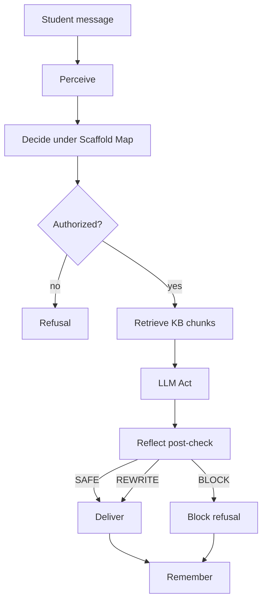

# Complete Workflow

One student turn through TL-Guard.

## Overview

## Step by step

1. **Perceive** — `detect_language`, BKT `update`, `classify_intent`.
2. **Decide** — `select_scaffold_tier` → `select_response_language` → `check_disclosure` under frozen Scaffold Map.
3. **Act** — `authorize_plan`; `KnowledgeRetriever.retrieve`; `build_system_prompt` with context; `llm.complete`.
4. **Reflect** — `post_check`; rewrite/block; optional audit log entry.
5. **Remember** — `update_session` with turn + `context_sources` metadata.

## Surfaces

| Path | Use |
|---|---|
| Streamlit | Chat + mastery panel + Sources used |
| `POST /sessions` + `/turns` | Programmatic tutoring |
| `tl-guard chat` | Terminal session |
| `GET /scaffold-maps/{id}` | Read frozen matrix |
| `GET /audit` | Research audit events |

There is **no** teacher LSM editor or escalation resolver workflow.
